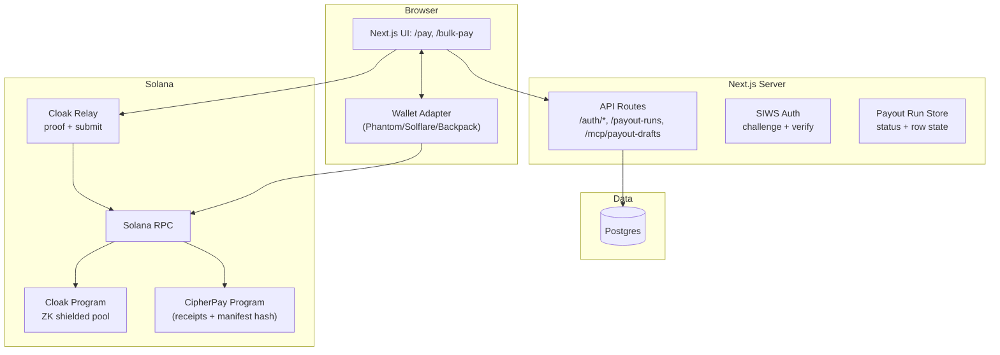
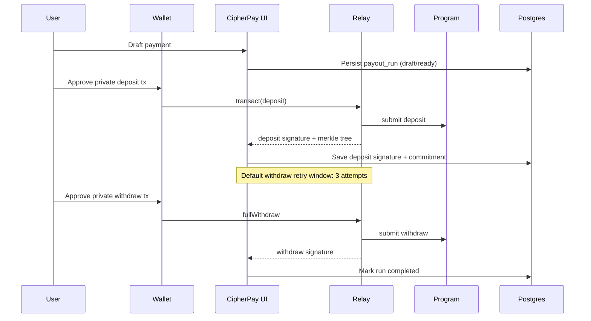
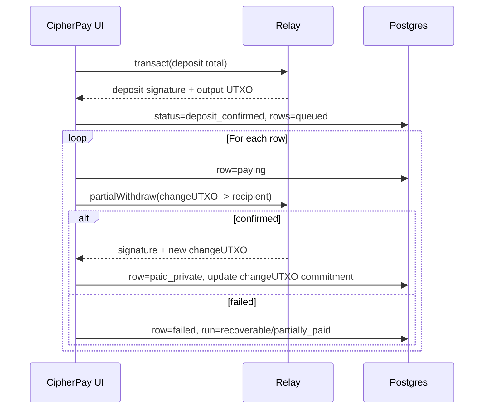
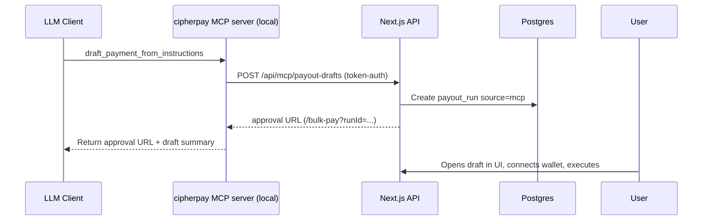

# CipherPay

CipherPay is a private payroll + payout workspace for Solana.

---

## What this repository contains

- **`web/`** — Next.js 15 app (React 19) with:
  - `/pay` (single payment) and `/bulk-pay` (batch payroll) UX
  - A durable **payout run** store in Postgres (draft → ready → depositing → paying → completed/recoverable)
  - A **ZK proof and shielded pool private payout rail** (deposit once, then withdraw)
  - An optional **MCP server** for agent-driven draft creation (human-in-the-loop approval)

- **`programs/cipherpay/`** — Anchor program implementing protocol primitives:
  - `Treasury` (authority + run sequence)
  - `PayoutRun` (manifest hash + totals + counters)
  - `PayoutItem` (recipient + amount)
  - `PayoutReceipt` (immutable execution receipt)

---

## Architecture (end-to-end)



---

## Private payout execution model

CipherPay’s privacy rail is deliberately “deposit once, pay many”.

### Manual pay (single recipient)

- Generate a private **deposit proof** for the payment amount.
- After the relay indexes the deposit, generate a private **withdraw proof** to the recipient.



### Bulk pay (batch payroll)

- Create **one** private deposit for the batch total.
- Execute sequential private `partialWithdraw` per row; the **change UTXO** becomes the input to the next row.

This is what enables clean recovery: the run can persist `current_change_utxo_commitment` and row status (`queued/paying/paid_private/failed`).



---

## Data model (Postgres)

### Core payout tables

- `payout_runs`
  - `entry_mode`: `manual | csv`
  - `status`: `draft | ready | depositing | deposit_confirmed | paying | partially_paid | completed | failed | recoverable`
  - `source`: `app | mcp` (tracks whether an AI agent created the draft)
  - On-chain Metadata: `private_deposit_signature`, `private_status`, `current_change_utxo_commitment`, `recovery_state`, totals in base units

- `payout_run_items`
  - Row status: `draft | ready | queued | paying | paid_private | failed`
  - Optional per-row evidence: `private_withdraw_signature`, `private_commitment`, `private_nullifier`
  - `attempt_count`, `last_attempt_at`

### Security + audit supporting tables

- Auth: `auth_nonces`, `sessions` (token hashes stored server-side)
- Invoices: memo/reference ciphertext + nonces (encrypted fields)

---

## Agent integration (MCP) — “AI drafts, humans approve”

CipherPay includes a local stdio **MCP server** that can create a *real* payout draft, but cannot execute payouts.



**Auth model:** the app uses Sign-In With Solana (SIWS) for session creation; the MCP endpoint uses a bearer token (`MCP_API_TOKEN`) to avoid ambient access.

---

## Hard numbers (from code, not vibes)

Operational limits & constants:

- **CSV limits (defaults):** 2.0 MB upload cap (`MAX_CSV_UPLOAD_BYTES=2,097,152`), **1,000-row** import cap (`MAX_CSV_IMPORT_ROWS=1000`).
- **Manual private transfer retry budget:** up to **3** withdraw attempts (stale root / indexing retries).
- **Bulk private transfer retry:** **2** stale-root retries per row (refresh Merkle state).
- **Relay settle delay:** 4,000 ms between bulk rows (gives the relay time to index and prevents “stale root” cascades).

Repo surface area (useful for judging engineering depth):

- **Web app:** ~8.7k TS/TSX LOC
- **Rust program/tests:** ~1.9k LOC
- **SQL migrations:** ~349 LOC
- **Payment rail implementation:** deposit + batch payroll + Merkle cache + ALT support
- **API routes:** 7 Next.js route handlers under `web/src/app/api/**/route.ts`
- **Anchor instruction modules:** 10 files under `programs/cipherpay/src/instructions/`

---

## Run locally (developer quickstart)

### Prerequisites

- Node.js 20+
- Postgres 14+
- `pnpm` (for `web/`)
- (Optional) Solana toolchain + Anchor for program development

### 1) Configure env

```bash
cp web/.env.example web/.env.local
```

Set at minimum:

- `DATABASE_URL`
- `SESSION_SIGNING_SECRET` (32+ bytes)
- `INVOICE_ENCRYPTION_KEY` (base64 32-byte key)

For the private payout rail (defaults are in `web/.env.example`):

- `NEXT_PUBLIC_PAYOUT_RAIL=`
- `NEXT_PUBLIC__PROGRAM_ID`
- `NEXT_PUBLIC__RELAY_URL`
- `NEXT_PUBLIC_PRIVATE_PAYOUT_SYMBOL`
- `NEXT_PUBLIC_PRIVATE_PAYOUT_MINT`
- `NEXT_PUBLIC_PRIVATE_PAYOUT_DECIMALS`

(Optional for agents) set `MCP_API_TOKEN` (a long random secret). If your MCP client expects `CIPHERPAY_MCP_TOKEN`, set it to the same value.

### 2) Install + migrate

```bash
cd web
pnpm install
pnpm db:migrate:
pnpm db:migrate:agent-pay
```

### 3) Start

```bash
cd web
pnpm dev
```

Open `http://localhost:3000`.

---

## Verification

From `web/`:

```bash
pnpm typecheck
pnpm lint
pnpm build
```

From the repo root (requires a Rust toolchain):

```bash
corepack enable
yarn test
```

---

## Roadmap

- USDC private payouts (mint-configurable assets)
- Deterministic resumability for large batches (persist more recovery state server-side)
- Wiring protocol receipts into the UI for verifiable attestations per payout run
- Organization/treasury roles + policy controls (rate limits, approvals, pause)
